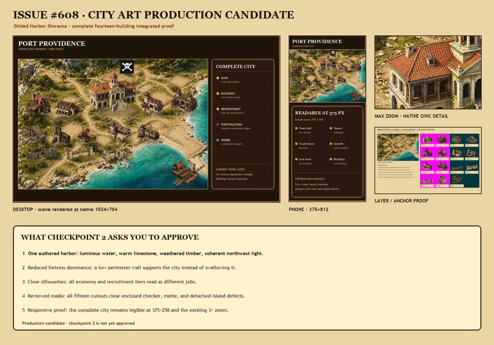

# Gilded Harbor city art — checkpoint 1

**Status:** operator checkpoint 1 for issue #608; not runtime art and not yet approved for
the full production batch.



This package answers the first art gate in #608 with one representative Direction B city.
It contains the town hall, tavern, shoreline shipyard, trade-house economy building,
barracks recruitment building, and a low stone-wall element. The proof applies D-049's
amendment: it keeps the layered harbor depth, limestone/timber material language, and
luminous water while reducing fortress dominance and giving the working districts
different silhouettes.

## Approval question

**Does this feel like the right city-art direction to carry through the complete building
set—specifically the open harbor composition, reduced fortress mass, and clearer tavern,
economy, recruitment, and shoreline-shipyard silhouettes?**

Approval advances #608 to the complete runtime-asset batch and its second integrated
starting/midgame/full-city checkpoint. Requested changes should name the visual role or
overall balance that feels wrong; no code review is needed.

## Native review files

- [Desktop composite, 1440×900](proofs/desktop-1440x900.webp)
- [Phone composite, 375×812](proofs/phone-375x812.webp) — includes the actual 375×258 city
  scene size
- [Maximum-zoom crop, 1024×704](proofs/max-zoom-1024x704.webp) — one viewport into the
  current 3× zoom, centered on tavern and trade house
- [Layer / depth / anchor sheet, 1600×1000](proofs/layer-separation-1600x1000.webp)
- [Empty runtime-size backdrop proof, 1024×704](proofs/empty-runtime-1024x704.webp)
- [Unframed representative scene, 1024×704](proofs/scene-runtime-1024x704.webp)

Open these at 100%. The contact sheet is a summary, not a substitute for native-size
inspection.

## What this checkpoint proves

- The harbor is an opaque, building-free 16:11 terrain/coast/road/foundation layer.
- All six constructed subjects are genuine-alpha WebP cutouts with safe transparent
  margins; the contact shadows are a seventh, separate layer.
- Placement uses the exact existing `SCENE_SLOTS` rectangles from `CityScene.tsx`; no
  runtime coordinates have changed.
- The town hall remains the civic anchor, but a low perimeter element no longer turns the
  city into a fortress first.
- Tavern, trade house, barracks, and shipyard differ in massing and silhouette at the
  375-pixel phone composition and in a current 3× zoom crop.
- The shipyard is a drydock/cradle/pier cutout placed across the current lower-right
  shoreline slot; no water is baked into it.
- Rebuilding the retained proof files from the retained sources is byte-identical.

## Deliberate boundary

This checkpoint changes only `docs/art/city-harbor-v2/`. It does not replace anything in
`apps/web/public/art/city/`, change `CityScene.tsx`, add a content ID, alter gameplay, or
claim that the remaining buildings and all five faction treatments are finished. Those
remain in #608 after checkpoint approval.

The built-in OpenAI image generator supplied source art under the operator's D-049
authorization. It returned a painted checker preview rather than an alpha channel for the
six requested cutouts, even after a targeted background-extraction retry. The retained
cutouts therefore use the documented deterministic checker-removal pass. The empty source
was already semantically clean. See [PROMPTS.md](PROMPTS.md) and [MANIFEST.md](MANIFEST.md)
for exact provenance and limitations.

## Rebuild and validate

The authoring environment needs Pillow, NumPy, and SciPy; the existing ComfyUI venv has
them and is not a runtime dependency.

```bash
~/aop-ai-tools/ComfyUI/venv/bin/python \
  docs/art/city-harbor-v2/tools/compose_checkpoint.py
~/aop-ai-tools/ComfyUI/venv/bin/python \
  docs/art/city-harbor-v2/tools/validate_checkpoint.py
```
