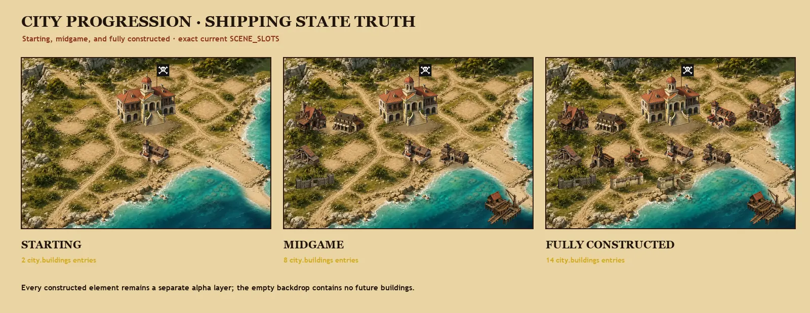

# Gilded Harbor city art — production candidate

> **#613 runtime approval pending:** the eight replacement captures were produced and
> inspected against exact source `a5a8fd5f8c522ebddfb146510b492bcea1c28ee2`, but their
> historical approval cannot approve these new pixels. The exact 37-frame renewal record lives in
> [`../city-ui-v2/RUNTIME-EVIDENCE-RENEWAL.md`](../city-ui-v2/RUNTIME-EVIDENCE-RENEWAL.md).

**Status:** checkpoint 1 and the Direction B art refinement remain approved. The issue #608
runtime candidate includes the requested Town Hall flag mount. Deterministic evidence is
complete, and the replacement live captures are bound to the target shipping sources with
integration-owner visual-settle and native-size review complete. Direct approval of the new
capture bytes is pending. The approval at evidence head
`dc11b60738f4f14b896532bf2db323b2bd054f5c` remains a non-reusable historical record in
[issue #608](https://github.com/jharvieux/AoP/issues/608#issuecomment-5551752263).



This package now contains the shipping Direction B city: an empty fourteen-foundation
harbor backdrop, all fourteen constructed buildings, a separate citadel tower, reviewed
alpha masks, runtime WebPs, responsive/full-state/faction/zoom evidence, and executable
asset/theme-fallback tests. D-049's amendment remains the visual rule: layered harbor
depth, warm limestone and timber, luminous water, reduced fortress dominance, and clear
working-district silhouettes.

## Approved art result

The operator approved the underlying complete starting-to-full city direction, including the
Town Hall-mounted faction flag, smaller phone read, recruitment progression, low
fortification perimeter, and connected shoreline Shipyard. The newly captured runtime pixels
showing that result remain pending direct approval. See
[PRODUCTION-MANIFEST.md](PRODUCTION-MANIFEST.md) for the complete contract, inventory,
evidence, budgets, and known boundary.

## Production review files

- [Live runtime capture record](RUNTIME-CAPTURES.md) — real game progression at starting,
  midgame, and fully built states, plus phone/desktop and current 3× zoom evidence
- [Live fully built desktop, 1440×900](runtime-captures/full-desktop-1440x900.jpg)
- [Live fully built phone, 390×844](runtime-captures/full-phone-390x844.jpg)
- [Live 3× shipyard detail, 390×844](runtime-captures/full-phone-3x-shipyard-390x844.jpg)

- [Starting / midgame / full contact, 1600×620](proofs/production-state-contact-1600x620.webp)
- [Five-faction contact, 1600×748](proofs/faction-contact-1600x748.webp)
- [Phone scene, 375×258](proofs/phone-scene-375x258.webp)
- [1× / current max-zoom evidence, 1600×1040](proofs/zoom-2x-evidence-1600x1040.webp)
- [Native compressed-tile seam census, 1600×920](proofs/backdrop-seam-census-1600x920.webp)
- [All production layers, 1800×1180](proofs/production-layer-contact-1800x1180.webp)
- [Pre-replacement behavior, 1600×620](proofs/baseline-current-states-1600x620.webp)
- Fifteen native 1024×1024 alpha stress proofs under `proofs/stress/`

The additional framed review files below preserve the familiar checkpoint-one paths while
showing the complete production candidate. The production files above are the primary
approval set.

### Additional framed review files

- [Desktop composite, 1440×900](proofs/desktop-1440x900.webp)
- [Phone composite, 375×812](proofs/phone-375x812.webp) — includes the actual 375×258 city
  scene size
- [Maximum-zoom crop, 1024×704](proofs/max-zoom-1024x704.webp) — one native-pixel viewport
  into the current 3× zoom, centered on town-hall architectural detail
- [Layer / depth / anchor sheet, 1600×1000](proofs/layer-separation-1600x1000.webp)
- Native 1024×1024 saturated alpha stress: [town hall](proofs/stress/townhall-magenta-1024.webp),
  [tavern](proofs/stress/tavern-magenta-1024.webp),
  [trade house](proofs/stress/tradehouse-magenta-1024.webp),
  [barracks](proofs/stress/barracks-magenta-1024.webp),
  [stone wall](proofs/stress/stonewall-magenta-1024.webp), and
  [shipyard](proofs/stress/shipyard-magenta-1024.webp)
- [Empty runtime-size backdrop proof, 1024×704](proofs/empty-runtime-1024x704.webp)
- [Unframed representative scene, 1024×704](proofs/scene-runtime-1024x704.webp)

Open these at 100%. The contact sheet is a summary, not a substitute for native-size
inspection.

The shipping backdrop uses persistent, explicitly positioned cells and a two-pixel codec
bleed/interior crop. A failed tile therefore leaves only its own cell transparent over the
CSS fallback, while the all-38-join validator compares every visible boundary with its
neighboring within-tile gradients.

## What checkpoint one proved

- The harbor is an opaque, building-free 16:11 terrain/coast/road/foundation layer.
- All six constructed subjects are genuine-alpha WebP cutouts with safe transparent
  margins, reviewed semantic masks, clear enclosed gaps, and no detached pale floor
  mattes; the contact shadows are a seventh, separate layer.
- Placement uses the exact existing `SCENE_SLOTS` rectangles from `CityScene.tsx`; no
  runtime coordinates have changed.
- The town hall remains the civic anchor, but a low perimeter element no longer turns the
  city into a fortress first.
- Tavern, trade house, barracks, and shipyard differ in massing and silhouette at the
  375-pixel phone composition and in a current 3× zoom crop.
- The shipyard is a drydock/cradle/pier cutout with a dedicated shore gangway. It spans
  dry sand/limestone and water inside the current lower-right slot; no water is baked into
  it.
- Rebuilding the retained proof files from the retained sources is byte-identical.

## Historical checkpoint-one boundary (superseded)

At checkpoint one, this package changed only `docs/art/city-harbor-v2/`. It did not replace anything in
`apps/web/public/art/city/`, change `CityScene.tsx`, add a content ID, alter gameplay, or
claim that the remaining buildings and all five faction treatments were finished. The
production batch documented above now completes that previously deferred scope.

The built-in OpenAI image generator supplied source art under the operator's D-049
authorization. It returned a painted checker preview rather than an alpha channel for the
six requested cutouts, even after a targeted background-extraction retry. The retained
cutouts therefore use the repository's established `rembg` IS-Net semantic-mask workflow,
then a documented single-component hardening and soft-edge pass. Explicit reviewed masks
are retained under `masks/`, and saturated magenta/dark-teal proofs expose enclosed checker
or matte failures. See [PROMPTS.md](PROMPTS.md) and [MANIFEST.md](MANIFEST.md) for exact
provenance and limitations.

## Rebuild and validate

Mask regeneration uses the repository's separate `rembg` environment and cached
`isnet-general-use` model. Source normalization, proof composition, and validation use
Pillow, NumPy, and SciPy from the same existing art-tools environment. None is a runtime
dependency.

```bash
NUMBA_DISABLE_JIT=1 ~/aop-ai-tools/venv/bin/python \
  docs/art/city-harbor-v2/tools/build_subject_masks.py
~/aop-ai-tools/venv/bin/python \
  docs/art/city-harbor-v2/tools/prepare_high_resolution_sources.py
~/aop-ai-tools/venv/bin/python \
  docs/art/city-harbor-v2/tools/compose_checkpoint.py
~/aop-ai-tools/venv/bin/python \
  docs/art/city-harbor-v2/tools/build_runtime_capture_bindings.py
~/aop-ai-tools/venv/bin/python \
  docs/art/city-harbor-v2/tools/validate_production.py
```
