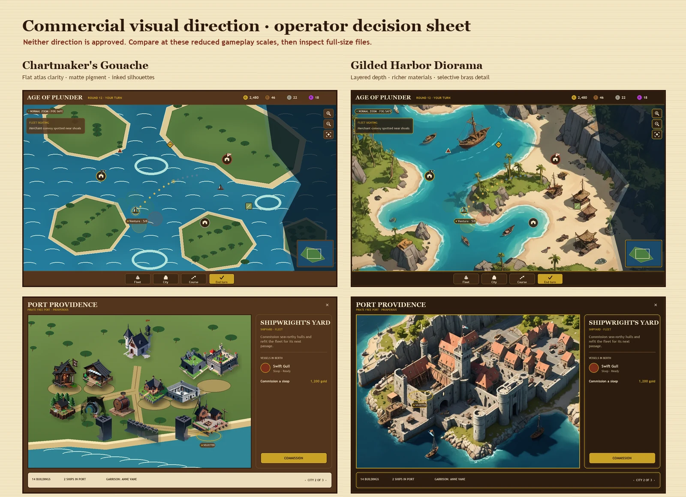
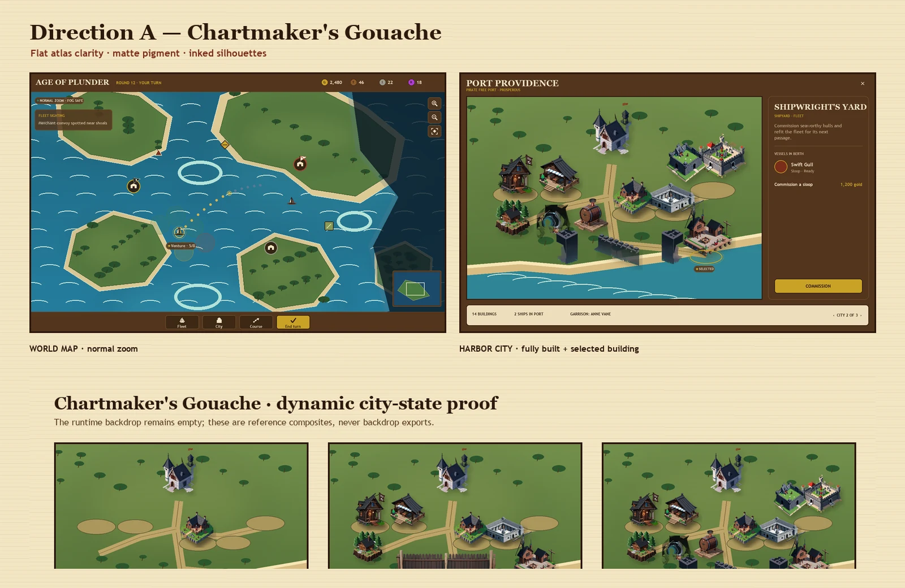
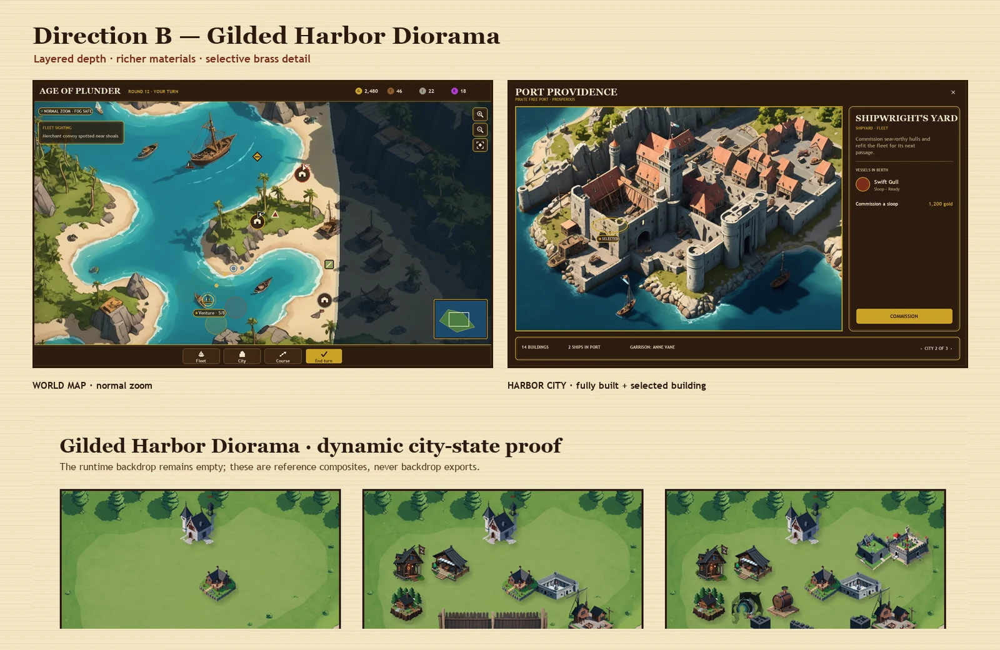

# Commercial visual direction v2

Status: **candidate package — operator selection is not yet recorded**.

This package is the issue #607 art-direction deliverable. It compares two complete visual directions for the world map and city screen, locks the rules shared by either direction, and defines the production contract for the dependent art and UI issues. Nothing here is a runtime asset and no gameplay or theme schema changed.

## The decision

The operator must choose exactly one rendering direction before #608–#613 produce assets or broadly restyle components:

- **Direction A — Chartmaker's Gouache:** flat matte atlas shapes, restrained ink contours, low texture density, and continuity with the established DreamShaper 8 cutout library. It is the clearer and lower-risk production path, but has less depth and material richness.
- **Direction B — Gilded Harbor Diorama:** layered terrain depth, luminous water, modeled limestone and timber, and selective brass detail from DreamShaperXL Turbo. It best answers the commercial-product-quality goal, but every city building must be rebuilt as a separable cutout; the full-city image is a target, never a backdrop export.

The recommendation is **Direction B** if the priority is the strongest visible quality step. Direction A remains viable if continuity, scope, and small-screen simplicity matter more than dimensional richness. This recommendation is not approval.

The operator's reply must identify **A or B** and explicitly accept or amend these nine axes: camera, lighting, palette, city composition, map readability, faction treatment, typography, icon style, and ornament level. The approval record template is in [MANIFEST.md](MANIFEST.md#operator-approval-record).

## Direction A — Chartmaker's Gouache

Rendering character:

- Flat, graphic, hand-painted atlas read with broad matte color blocks and sparing ink edges.
- Terrain and tokens separate cleanly at 24–40 px; fog and route feedback remain prominent.
- City proof uses the current DreamShaper 8-derived modular building library on one deterministic harbor ground plane. It proves arbitrary construction subsets, but the final production pass must repaint the inconsistent legacy cutouts to one light, scale, and edge language.
- Chrome uses dark stained wood, parchment text, and restrained gold; ornament stays at the outer frame and actionable controls.

Native review files:

- World map: [desktop 1440×900](candidates/direction-a/world-map-desktop-1440x900.webp), [tablet 768×1024](candidates/direction-a/world-map-tablet-768x1024.webp), [phone 375×812](candidates/direction-a/world-map-phone-375x812.webp)
- Harbor city: [desktop 1440×900](candidates/direction-a/city-desktop-1440x900.webp), [tablet 768×1024](candidates/direction-a/city-tablet-768x1024.webp), [phone 375×812](candidates/direction-a/city-phone-375x812.webp)
- Dynamic city: [starting / midgame / full](candidates/direction-a/city-start-mid-full-1440x560.webp)

## Direction B — Gilded Harbor Diorama

Rendering character:

- Layered painted depth with a high-angle harbor-diorama read, coherent limestone/timber materials, warm roof accents, and blue-green ambient bounce.
- Map geography remains readable beneath richer shoreline, vegetation, and water detail; tokens use bold semantic silhouettes instead of competing with the painting.
- The full city source establishes material, density, citadel, drydock, and shoreline targets. It is intentionally paired with a separate modular state proof because diffusion did not obey exact construction counts. Production must recreate the target as empty backdrop plus independent building layers.
- Chrome uses near-blackened wood and a thin brass keyline. It is quieter than the art and does not introduce a second palette.

Native review files:

- World map: [desktop 1440×900](candidates/direction-b/world-map-desktop-1440x900.webp), [tablet 768×1024](candidates/direction-b/world-map-tablet-768x1024.webp), [phone 375×812](candidates/direction-b/world-map-phone-375x812.webp)
- Harbor city: [desktop 1440×900](candidates/direction-b/city-desktop-1440x900.webp), [tablet 768×1024](candidates/direction-b/city-tablet-768x1024.webp), [phone 375×812](candidates/direction-b/city-phone-375x812.webp)
- Dynamic city: [starting / midgame / full](candidates/direction-b/city-start-mid-full-1440x560.webp)

## Shared north star

Both candidates remain inside **Weathered Parchment & Rope** (D-023). The operator is choosing rendering character, not a new application theme. Both use the same representative world state and interface:

- normal-zoom coastline and fog frontier;
- own, enemy, and neutral cities distinguished by crest silhouette, flag pattern, and ring as well as hue;
- selected own fleet, enemy fleet, current-turn/later-turn route, movement range, sea encounter, land encounter, and land site;
- town hall, tavern, shoreline shipyard, economy, recruitment, and fortification roles;
- selected shipyard/drydock and representative management panel;
- HUD, resources, command dock, minimap, and navigation controls;
- phone layouts without tiny permanent labels.

The full city images are **styleframes only**. A shippable city backdrop may contain terrain, coast, roads, and empty foundations, but no constructed building, flag, name, value, selection ring, or UI. The [city state proofs](candidates/direction-b/city-start-mid-full-1440x560.webp) are the structural authority; the selected direction's full-city styleframe is the finish authority.

## Production references

- [Visual bible](VISUAL-BIBLE.md) — camera, lighting, palette, material, faction, type, icon, interaction, responsive, and LOD rules
- [Runtime specification](RUNTIME-SPEC.md) — dimensions, alpha, anchors, depth, exports, budgets, loading, fallback, names, and theme IDs
- [Manifest and provenance](MANIFEST.md) — source disposition, generation recipes, licenses, known limits, and approval gate
- [City scale/depth/anchor diagram](contracts/city-scale-depth-anchor-1600x1000.webp)
- [Map token and zoom-LOD diagram](contracts/map-token-lod-1600x930.webp)
- [Palette, lighting, material, typography, icon, and state sheet](contracts/visual-system-1600x1040.webp)
- [Grayscale readability proof](contracts/readability-grayscale-1600x1030.webp)
- [Rejected generation contact sheet](candidates/rejected-generation-contact-sheet-1600x930.webp)

## Review protocol

1. Open each desktop, tablet, and phone file at 100%; do not judge only from the summary sheet.
2. Confirm all map semantics remain discoverable in color and in the grayscale proof without exposing fog-hidden information.
3. Compare starting, midgame, and full cities for a stable camera, ground plane, and intentional empty space.
4. Confirm the full city feels like one harbor while accepting that production exports remain modular.
5. Choose A or B and record the nine-axis approval. Production work remains blocked until that record exists.
