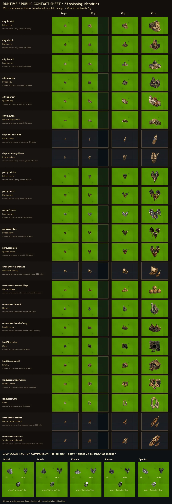

# World-map v2 token proof and runtime delivery

**Status:** checkpoint 1 was approved with the recommended city refinement. The approved Direction B family has now been prepared and wired as issue #609's runtime candidate; deterministic in-game phone, tablet, and desktop captures plus checkpoint-2 operator approval remain pending. Visibility and gameplay rules are unchanged.

## Review the proof

The family contains six city identities, two ship classes, five faction parties, one sea encounter, all three land encounters, and all four sites required by the issue. Every candidate uses the approved Direction B camera, northwest light, restrained palette, optical safety margin, and a cue that does not depend on color alone.

The 32 px column deliberately places each token on the visible side of a fog frontier. The separate fog proof is explicit: a hidden entity receives no token, silhouette, highlight, shadow, label, or high-detail substitute. These are presentation examples only and do not propose a visibility-rule change.

## Checkpoint boundary

- `sources/selected/` holds normalized 512 px RGBA proof sources.
- `tokens/` holds optimized 256 px RGBA candidates used by the sheets.
- `asset-registry.json`, `PROMPTS.md`, and `MANIFEST.md` preserve provenance and constraints.
- `tools/` contains deterministic preparation, composition, and fail-loud validation.
- Checkpoint 1 approved the art direction, not the final checkpoint-2 runtime captures.

## Runtime candidate

The runtime pass adds semantic matte cleanup without overwriting the checkpoint sources, exports 512 px review sources and optimized 256 px tokens, and publishes byte-identical copies of 23 identities. The two added identities replace the legacy native-canoe and settler-launch encounter art so all production sea encounters share the approved camera, lighting, and materials.

The four overview pages and per-identity `matte-full-footprint-512-*.webp` proofs are in `proofs/matte-stress/`. Each full-footprint proof repeats the complete 512 px alpha footprint over approved land or deep-water texture, near-black, saturated magenta, and saturated cyan. `matte-full-footprint-96-all.webp` repeats the same fields at exact 96 px. This deliberately exposes pale matte and contact remnants that representative terrain alone can hide. Named semantic masks now cover the Spanish party's forward and rear contact edges plus the native-village and hermit base edges; twelve source-visible witness pixels must become exactly zero alpha or validation fails.

`runtime-additions.json` records the exact provenance for the two additional OpenAI generations. Their original 1,254 px byte streams are not retained: the original hashes and sizes remain in provenance, while the committed project-bound RGBA PNGs are deterministic 512 px normalizations at 138,454 and 228,737 bytes. `sources/runtime/polish-receipt.json` records every cleaned source, witness, and proof hash. `runtime-public-receipt.json` binds each public URL to a byte-identical runtime token. `tools/validate_runtime.py` fails loud on retained/original provenance ambiguity, dimensions, alpha/privacy sentinels, semantic-witness escape, any committed or referenced image above 300 KiB, public-copy drift, 23-identity runtime-sheet coverage, or nondeterministic recomposition. Its negative controls prove those new failure paths reject an oversized image, a nonzero witness, and checkpoint-only coverage.

## Operator decision

Checkpoint 2 is not yet approved. Review the exact-head phone, tablet, and desktop in-game captures after assets load—including fog states, missing-asset fallback, and theme override cases—before approving the runtime presentation.
