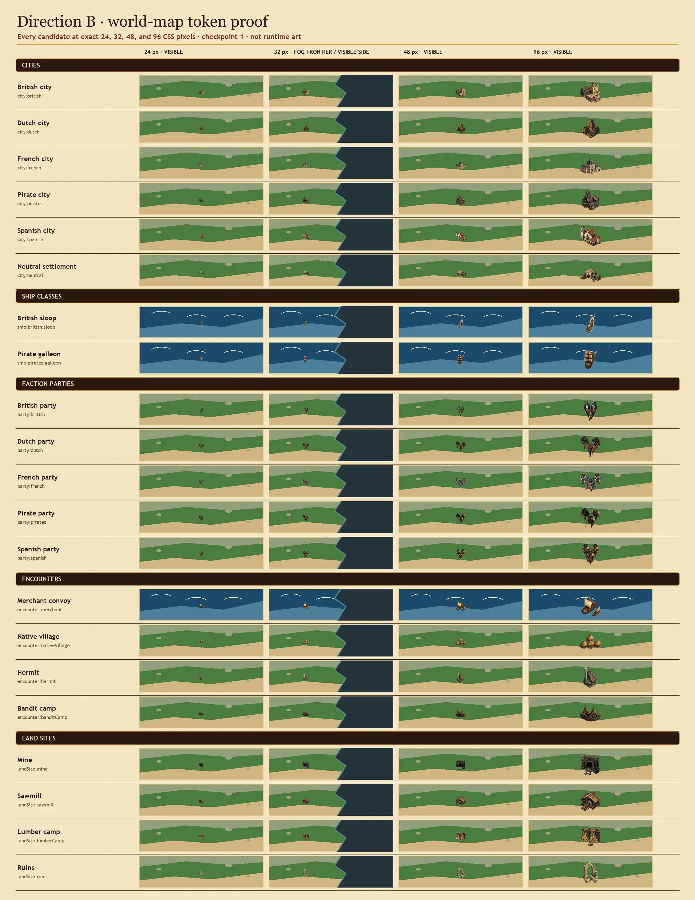
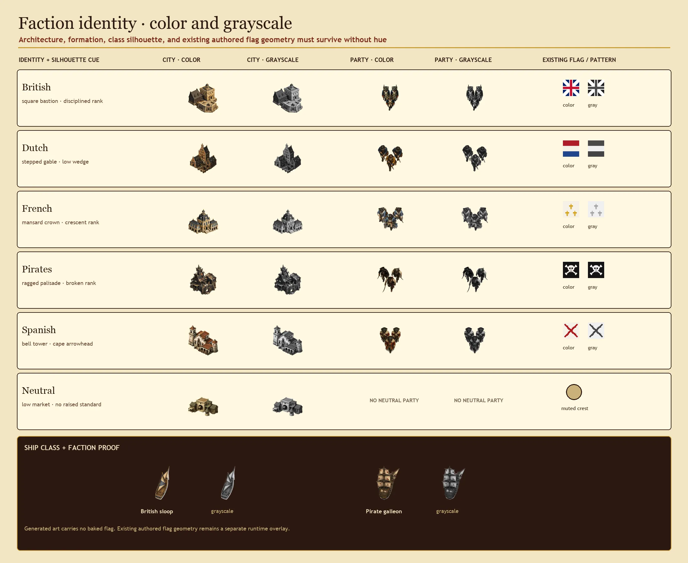
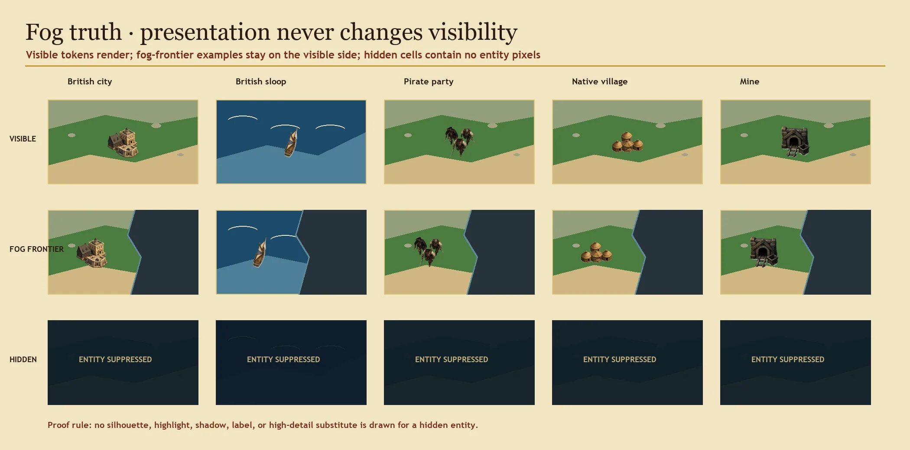
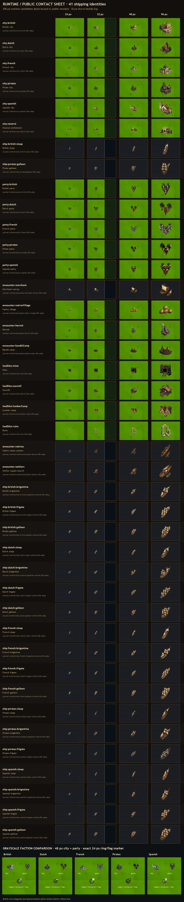
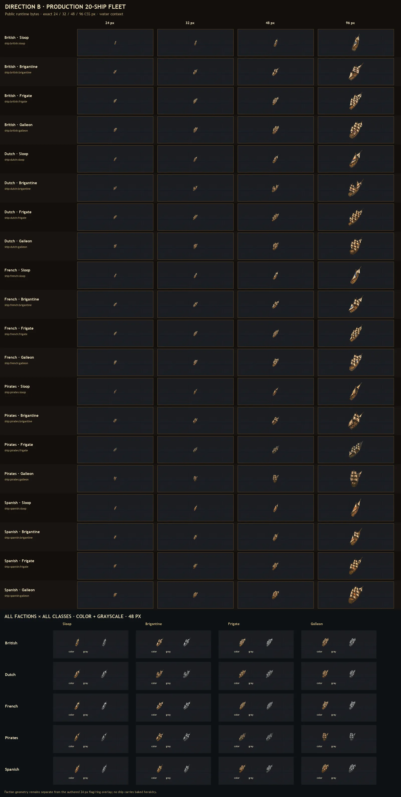
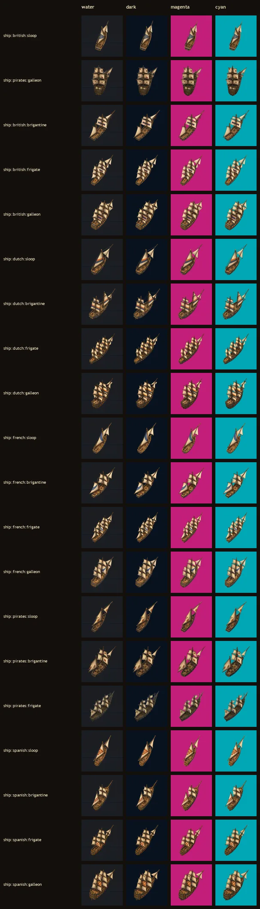
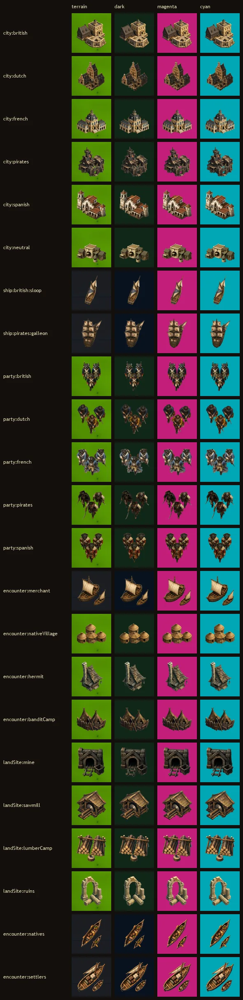
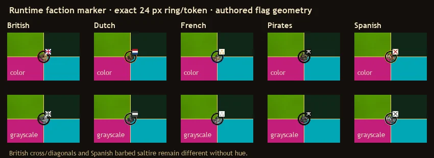

# World-map v2 token proof and runtime delivery

**Status:** checkpoint 1 was approved with the recommended city refinement, and checkpoint
2 was approved at `63fc0fd29c9659f93901b36c1822bd7100547188`. The complete Direction B
ship-family repair independently passed at `7c4c56d7a28baea8a7f176e51fadd15d70353648`.
Fresh phone/tablet/desktop captures now show that repaired runtime and await renewed
checkpoint-2 approval for their exact pixels. Visibility and gameplay rules are unchanged.

## Review the proof

The family contains six city identities, two ship classes, five faction parties, one sea encounter, all three land encounters, and all four sites required by the issue. Every candidate uses the approved Direction B camera, northwest light, restrained palette, optical safety margin, and a cue that does not depend on color alone.

The 32 px column deliberately places each token on the visible side of a fog frontier. The separate fog proof is explicit: a hidden entity receives no token, silhouette, highlight, shadow, label, or high-detail substitute. These are presentation examples only and do not propose a visibility-rule change.

## Checkpoint boundary

- `sources/selected/` holds normalized 512 px RGBA proof sources.
- `tokens/` holds optimized 256 px RGBA candidates used by the sheets.
- `asset-registry.json`, `PROMPTS.md`, and `MANIFEST.md` preserve provenance and constraints.
- `tools/` contains deterministic preparation, composition, and fail-loud validation.
- Checkpoint 1 approved the art direction. The refreshed
  [runtime capture record](RUNTIME-CAPTURES.md) is bound to the complete-fleet repair at
  `7c4c56d7a28baea8a7f176e51fadd15d70353648` and awaits renewed checkpoint-2 approval.

## Runtime candidate

The shipping runtime pass adds semantic matte cleanup without overwriting the checkpoint sources, exports 512 px review sources and optimized 256 px tokens, and publishes byte-identical copies of 41 identities. Those identities include the original 21-token proof, two coherent native-canoe and settler-launch replacements, and the complete five-faction by four-class ship family. British sloop and Pirate galleon reuse the two approved ship tokens; the other 18 ships are distinct built-in OpenAI generations bound to exact prompts and source receipts.

The six overview pages and per-identity `matte-full-footprint-512-*.webp` proofs are in `proofs/matte-stress/`. Each full-footprint proof repeats the complete 512 px alpha footprint over approved land or deep-water texture, near-black, saturated magenta, and saturated cyan. `matte-full-footprint-96-all.webp` repeats the same fields at exact 96 px. This deliberately exposes pale matte and contact remnants that representative terrain alone can hide. Named semantic masks cover the Spanish party's forward and rear contact edges plus the native-village and hermit base edges; twelve source-visible witness pixels must become exactly zero alpha or validation fails. The fleet-only sheets independently require every one of the 20 public ship identities, so the retained checkpoint-era 23-item sheet cannot satisfy current runtime evidence.

`runtime-additions.json` records exact provenance for all 20 post-checkpoint generations: the two sea encounters and 18 newly generated ships. Every selected raw byte stream was measured and then replaced in place by a deterministic project-bound 512 px RGBA normalization below 300 KiB; original raw hashes, sizes, dimensions, alpha state, and capture paths remain as explicitly unretained provenance. Three rejected fleet outputs are recorded rather than silently discarded. `sources/runtime/polish-receipt.json` records every cleaned source, witness, and proof hash. `runtime-public-receipt.json` binds each public URL to a byte-identical runtime token. `tools/validate_runtime.py` fails loud on retained/original provenance ambiguity, prompt/reference drift, dimensions, alpha/privacy sentinels, semantic-witness escape, any committed or referenced image above 300 KiB, public-copy drift, incomplete 41-identity or 20-ship evidence, or nondeterministic recomposition. Its negative controls prove those paths reject an oversized image, a nonzero witness, incomplete shipping coverage, the old checkpoint-only sheet, and an incomplete ship matrix.

## Operator decision

Checkpoint 2 was approved at `63fc0fd29c9659f93901b36c1822bd7100547188`. The later
complete-fleet repair independently passed at
`7c4c56d7a28baea8a7f176e51fadd15d70353648`, and the refreshed
[runtime capture record](RUNTIME-CAPTURES.md) now pictures that repaired head. Those exact
pixels still require renewed operator approval. Focused tests bind render and preload to the
same registry winner, retain theme-override priority, preserve missing-asset fallback, and
keep hidden identities out of preload requests.
