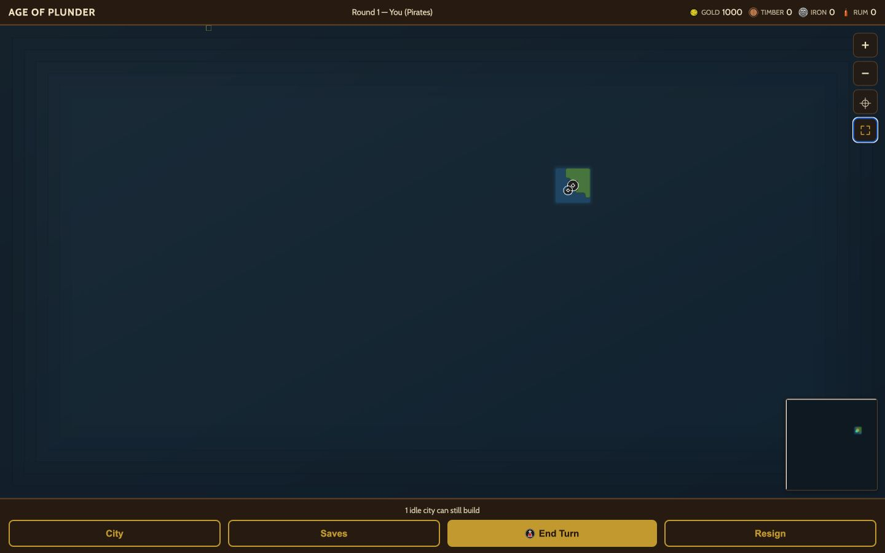
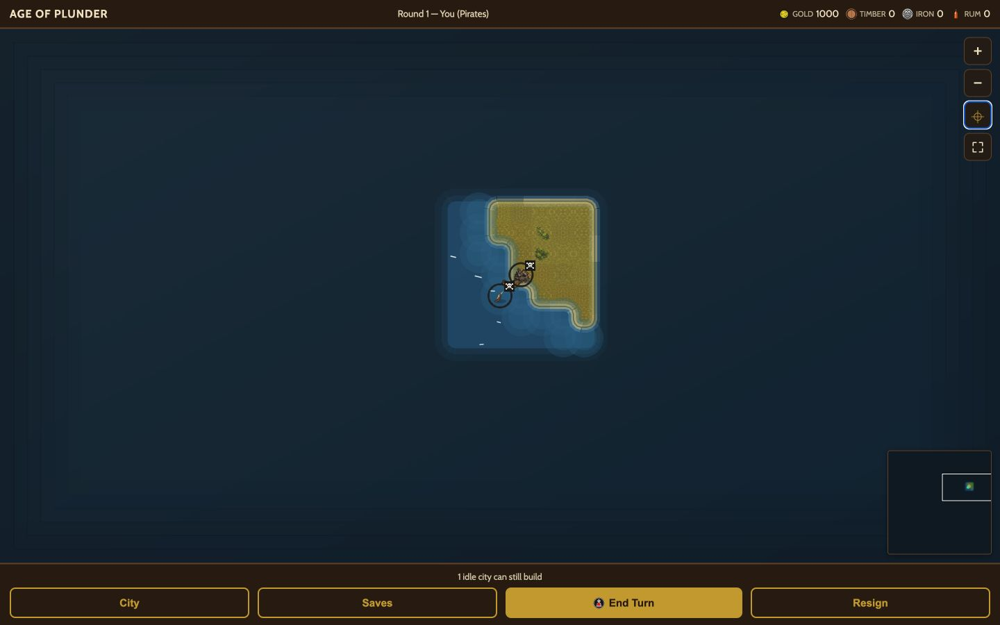
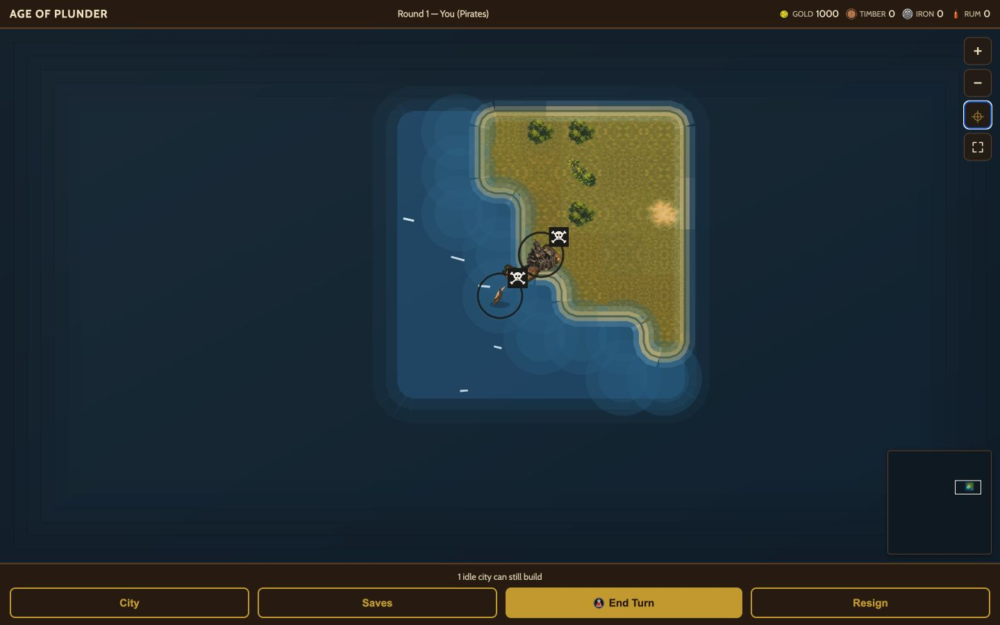
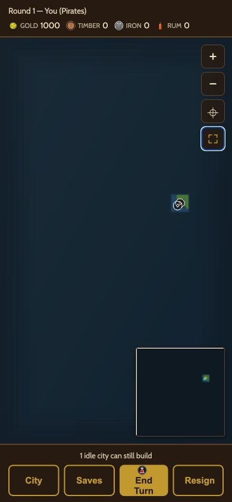
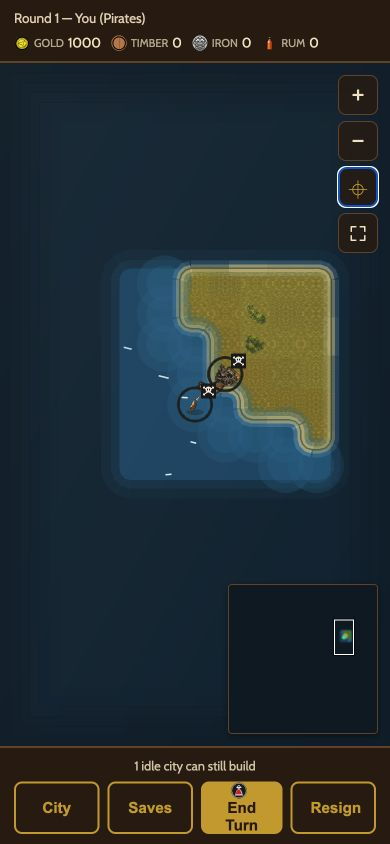
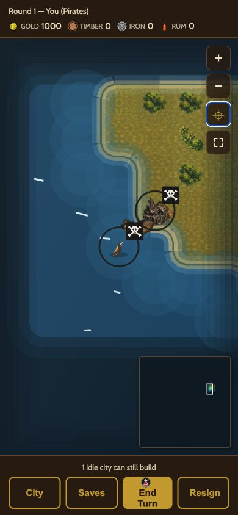

# Three-band runtime captures

All six captures come from one untouched round-1 96×96 square-map session with five seats,
default/no-override theme, and no gameplay action between frames. The browser origin was fresh so
the development service worker could not substitute an older same-path terrain asset. Exact image
hashes, camera procedures, canvas sizes, and limitations are in `runtime-capture-receipt.json`. The
receipt binds the repaired renderer and runtime terrain assets at
`76214b0df4de930d5b9d0cae9fe0f3a7521de494`; any bound-source or capture-byte change invalidates
this evidence.

The New Game UI creates a seeded deterministic map but does not expose that seed. These images
therefore bind the same live session and renderer/art digest, while the separately recorded seed-611
square/hex trace binds repeatable map and terrain-selection checksums.

## Desktop — 1440×900

### Overview

### Tactical

### Detail

## Phone — 390×844

### Overview

### Tactical

### Detail

## Interaction smoke

The same largest-map session completed 22 bidirectional pan drags, 12 zoom-button transitions
through overview/tactical/detail, and two fleet recenters on the phone viewport. The browser console
reported no warning or error. The in-app backend did not expose Performance Timeline entries, so no
browser frame-time percentile is claimed; the reproducible CPU/draw-work trace is recorded in
`PERFORMANCE.md`.

These captures still require operator approval. They are not represented as an approved checkpoint.
